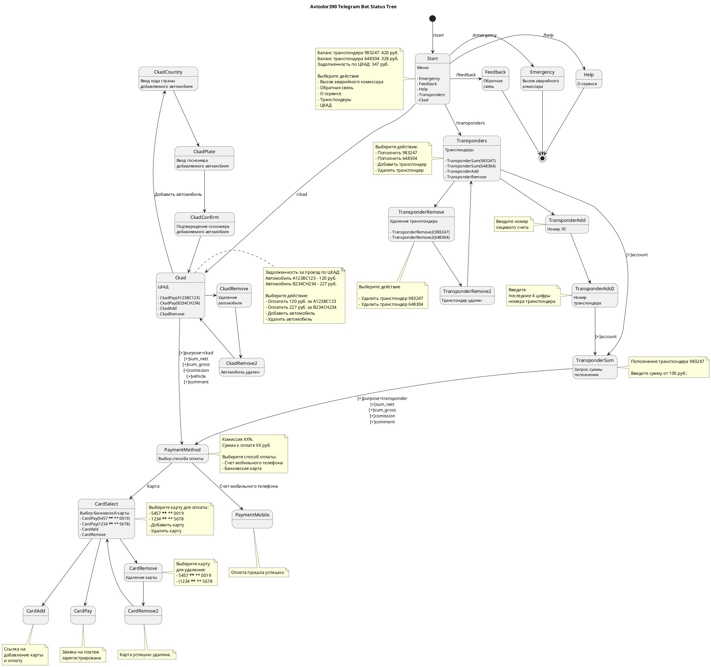

# A simple proof of concept prototype of a Telegram bot for Avtodor

https://t.me/avtodor390_bot

## Bot Status Tree


## Process monitoring
[Supervisor](http://supervisord.org/) is used to keep the script running.

A short instruction from Laravel
https://laravel.com/docs/8.x/queues#supervisor-configuration

Supervisor config file `/etc/supervisord.conf`
 
Process config file is listed below `/etc/supervisord.d/avtodor390_bot.ini`
 
```ini
[program:avtodor390_bot]
command=/home/superuser/projects/avtodor390_bot/run.sh
user=superuser
autostart=true
autorestart=true
stderr_logfile=/tmp/avtodor390_bot.err
stdout_logfile=/tmp/avtodor390_bot.out
numprocs=1
directory=/home/superuser/projects/avtodor390_bot
```

Starting process:
```
sudo supervisorctl reread
sudo supervisorctl update
sudo supervisorctl start avtodor390_bot:*
```

## Other Resources
[Emoji Unicode table](https://www.unicode.org/emoji/charts/full-emoji-list.html)
