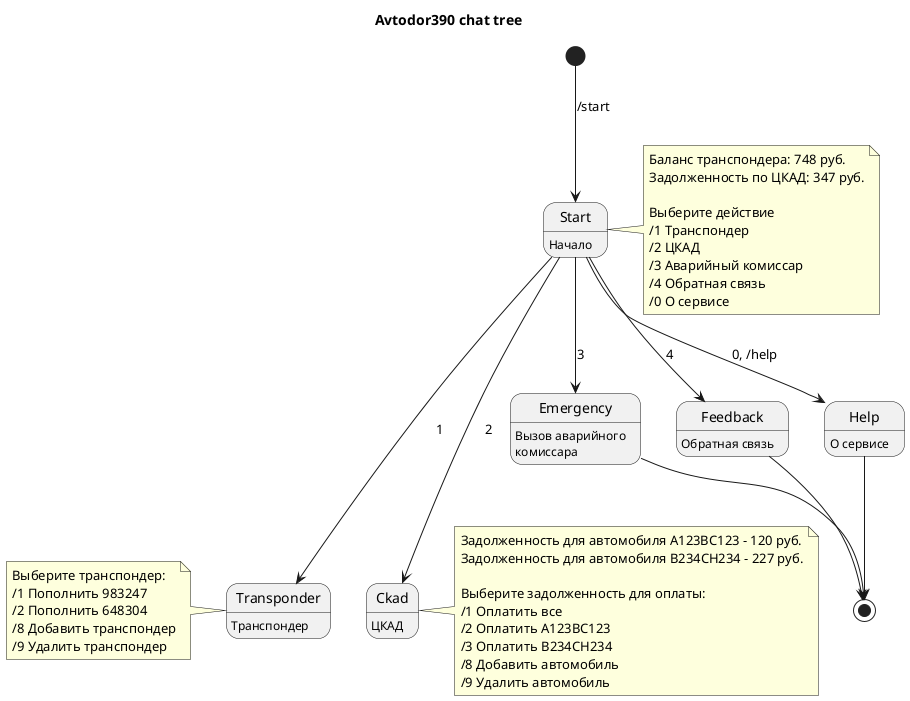

```plantuml
@startuml
'https://plantuml.com/state-diagram
title Avtodor390 chat tree

Start: Начало
note right of Start
    Баланс транспондера: 748 руб.
    Задолженность по ЦКАД: 347 руб.

    Выберите действие
    /1 Транспондер
    /2 ЦКАД
    /3 Аварийный комиссар
    /4 Обратная связь
    /0 О сервисе
end note
Transponder: Транспондер
note left of Transponder
    Выберите транспондер:
    /1 Пополнить 983247
    /2 Пополнить 648304
    /8 Добавить транспондер
    /9 Удалить транспондер
end note
Ckad: ЦКАД
note right of Ckad
    Задолженность для автомобиля А123ВС123 - 120 руб.
    Задолженность для автомобиля В234СН234 - 227 руб.

    Выберите задолженность для оплаты:
    /1 Оплатить все
    /2 Оплатить А123ВС123
    /3 Оплатить В234СН234
    /8 Добавить автомобиль
    /9 Удалить автомобиль
end note
Emergency: Вызов аварийного\nкомиссара
Feedback: Обратная связь
Help: О сервисе

[*] --> Start : /start
Start ---> Transponder : 1
Start ---> Ckad : 2
Start --> Emergency : 3
Start --> Feedback : 4
Start --> Help : 0, /help

Emergency --> [*]
Feedback --> [*]
Help --> [*]
@enduml
```
